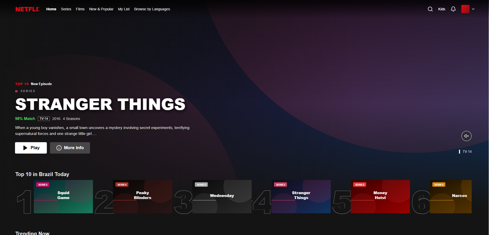
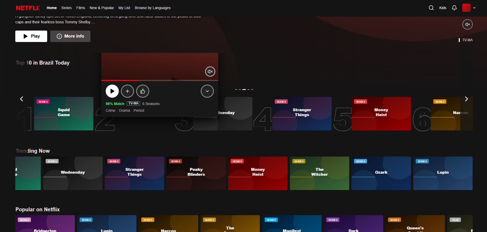
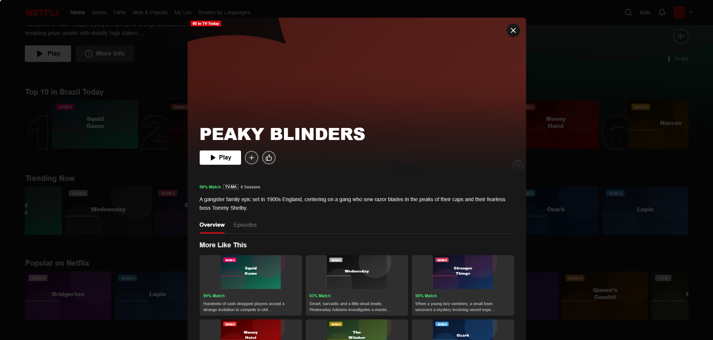
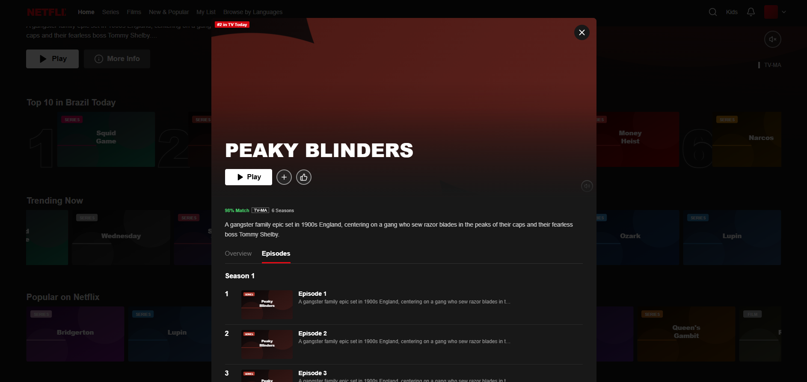
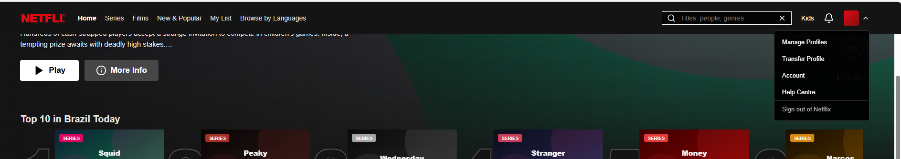

# Netflix Clone — Interface de streaming

Clone visual da Netflix construído com **React 19** e **Vite 6**. Projeto **frontend-only** com dados mock (24 títulos), carrosséis horizontais, hero banner, Top 10 e modal de detalhes — ideal para portfólio de UI.



## Sobre o projeto

Réplica fiel da experiência Netflix: navbar com busca, destaque em tela cheia, fileiras por categoria (Trending, Popular, Continue Watching), ranking Top 10 e previews ao passar o mouse. Posters gerados via SVG — sem backend nem autenticação.

## Funcionalidades

- Navbar estilo Netflix (Home, Séries, Filmes, Minha lista)
- Hero com título em destaque, metadados e botões Play / Mais informações
- Carrosséis horizontais por categoria
- Top 10 com numeração visual
- Hover com preview e modal de detalhes
- 24 títulos mock com posters SVG
- Layout responsivo e tema escuro

## Stack

| Camada | Tecnologias |
|--------|-------------|
| Frontend | React 19, Vite 6, Lucide React |
| Backend | — (não aplicável) |

## Como rodar

```bash
npm install
npm run dev
```

Abra [http://localhost:5174](http://localhost:5174) (porta configurada no Vite).

### Build de produção

```bash
npm run build
npm run preview
```

## Estrutura

```
Netflix clone/
├── fotosProjeto/       # Capturas de tela
├── NetflixClone.jsx    # Componente principal da UI
├── src/main.jsx        # Entry point
├── index.html
├── vite.config.js
└── dist/               # Build (após npm run build)
```

## Galeria

### Home e hero


### Carrosséis


### Navegação e busca


### Hover e preview


### Modal de detalhes

