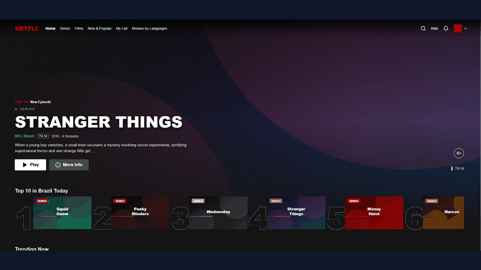
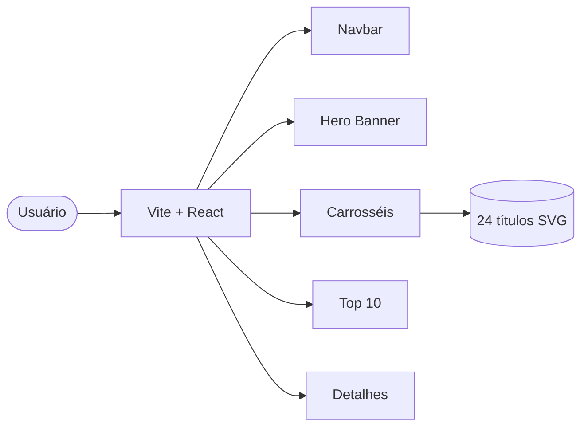
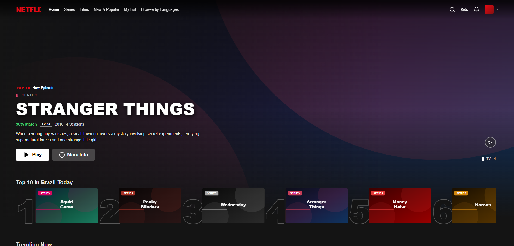
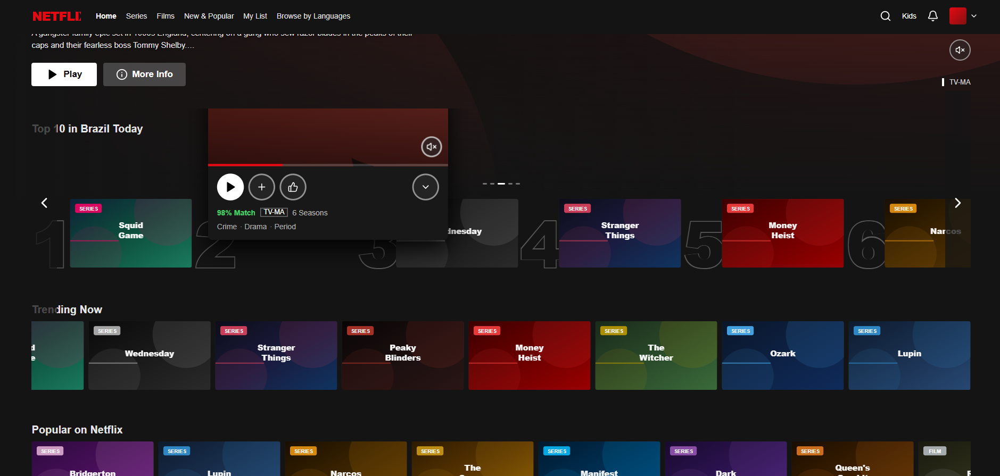
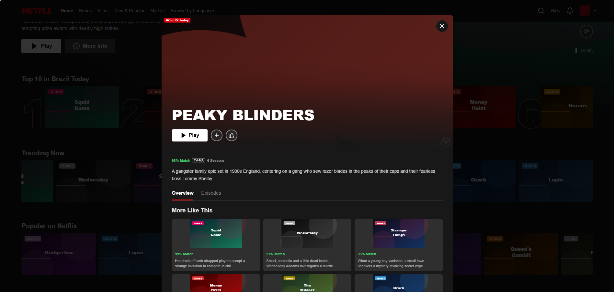
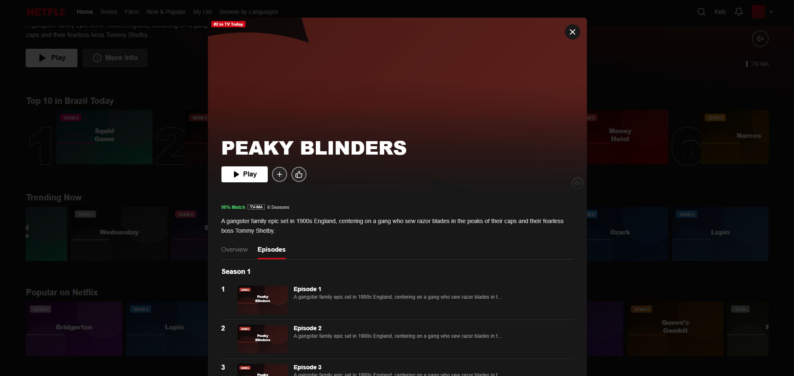
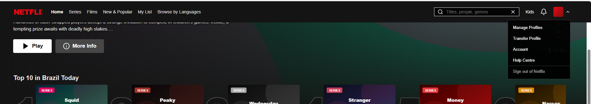

<div align="center">


### Streaming UI · React + Vite


<br/>

[](https://brayansilver.github.io)
[](https://github.com/BrayanSilver)
[](https://www.linkedin.com/in/brayan-r-silveira-b80636150/)
[](mailto:brayansilver.teen@gmail.com)


</div>

---

## 📌 Sobre

Clone visual da Netflix com hero banner, carrosséis, Top 10, hover preview e modal de detalhes. **Frontend-only** com dados mock.

## 📊 Status cards

<div align="center">
  
  
</div>

## 🎬 Demo animada

<div align="center">



</div>

## 🔄 Fluxo da UI



## ▶️ Como rodar

```bash
npm install
npm run dev
```

Abra http://localhost:5174

```bash
npm run build && npm run preview
```

## 🖼️ Galeria

### Home / Hero


### Carrosséis


### Navegação


### Hover preview


### Modal



---

<div align="center">

**Brayan R. Silveira** · Full Stack Developer

[Portfolio](https://brayansilver.github.io) · [GitHub](https://github.com/BrayanSilver) · [LinkedIn](https://www.linkedin.com/in/brayan-r-silveira-b80636150/)


</div>
